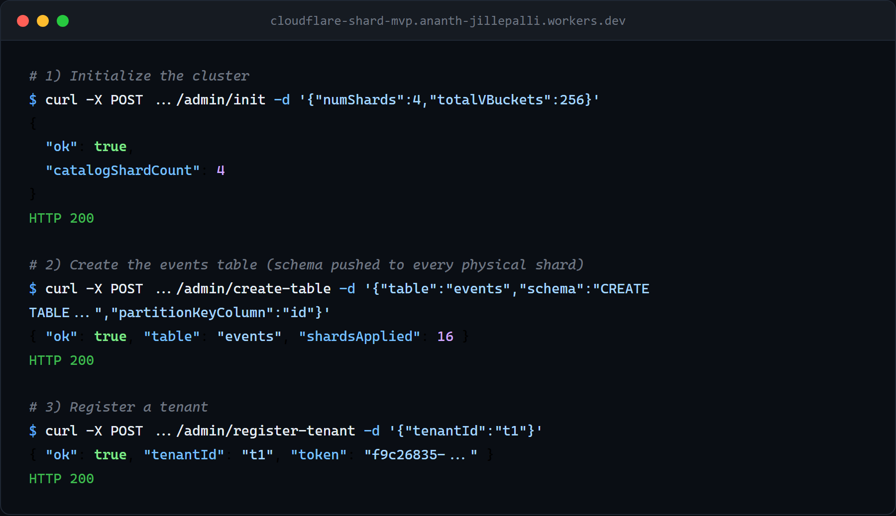
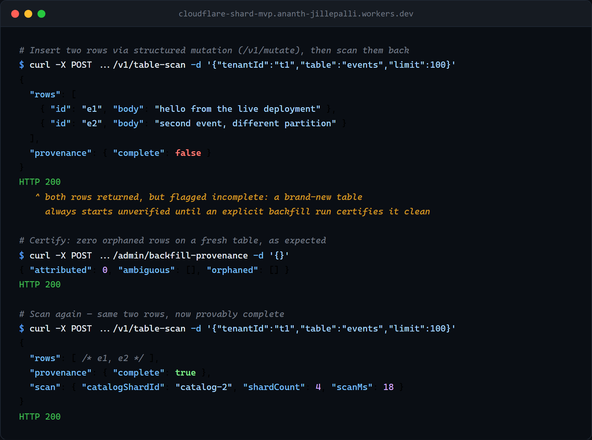

# CloudflareShard MVP

A concrete MVP for a sharded SQL layer on top of Cloudflare Durable Objects (SQLite-backed).

## What this prototype demonstrates

- One logical SQL endpoint in a Worker.
- Catalog DO as control plane for table registry and vBucket map.
- Shard DOs as single-threaded SQLite execution nodes.
- Deterministic single-shard routing via tenantId + table + partitionKey.
- Scatter read endpoint for fan-out SELECT.
- Online vBucket migration: dual-write backfill with a fenced, checksum-verified cutover —
  `/admin/split-vbucket` performs a real data move, and `/admin/drain-shard` fully evacuates a
  shard (vbuckets first, then secondary-index placement rings via deterministic substitution,
  protected by a per-index write fence so no index entry is stranded on a shard mid-evacuation).
  See `docs/SPEC.md` §11 for the backfill/cutover/drain algorithm.
- A durable, TTL'd topology-operation lock serializes drain/split/migrate/create-index/drop-index
  so two concurrent cluster-reshaping operations can't race each other's preconditions;
  `/admin/topology-lock-status` and `/admin/force-release-topology-lock` give an operator
  visibility and recovery. See `docs/SPEC.md` §7 for both routes' request/response shapes.
- Mutation idempotency via requestId, rejecting replay with a mismatched SQL/params pair instead of returning a stale result.

## Learn more

This README is a short entry point. Deeper reference material lives here:

- **[docs/SPEC.md](docs/SPEC.md)** — the canonical protocol/architecture reference: schemas,
  every HTTP route's request/response shape, the routing algorithm, write-idempotency contract,
  transaction semantics, rebalancing/split/drain, and the security/multi-tenancy model.
- **[client/README.md](client/README.md)** — the typed TypeScript SDK + CLI reference.
- **[examples/rpc-consumer/README.md](examples/rpc-consumer/README.md)** — calling this API over
  a Durable Object RPC / Worker service binding instead of HTTP.
- **[examples/shardscope/README.md](examples/shardscope/README.md)** — a live mission-control
  dashboard for topology, resharding, and chaos/load testing.
- **[TODOS.md](TODOS.md)** — the open roadmap and resolved milestones.
- **[CHANGELOG.md](CHANGELOG.md)** — release history.

## Deploy your own cluster

[](https://deploy.workers.cloudflare.com/?url=https://github.com/ajillepalli/CloudflareShard)

One click clones this repo into your GitHub and deploys the cluster to **your own
Cloudflare account**: one Worker plus three SQLite Durable Object classes
(`CATALOG` control plane, `SHARD` data plane, `COORDINATOR` for 2PC), provisioned
automatically from the `[[migrations]]` in `wrangler.toml`. There are no KV/D1/R2
resources — the cluster is self-contained.

**Cost:** Durable Objects require the **Workers Paid** plan, and everything created
is **billed to your account** (Worker + Durable Object requests/duration/storage).
This is a real database in your account, not a sandbox. Tear it down when you're
done.

**After deploy:**
1. Set the `ADMIN_TOKEN` secret (the setup page prompts for it via `.env.example`)
   to a strong random value — `openssl rand -hex 32`. It gates the whole `/admin/*`
   surface; without it the Worker returns `500 ADMIN_TOKEN is not configured`.
2. Initialize the topology:
   ```bash
   curl -X POST https://<your-worker>.workers.dev/admin/init \
     -H "authorization: Bearer $ADMIN_TOKEN" -H "content-type: application/json" \
     -d '{"numShards": 2, "totalVBuckets": 16}'
   ```
3. To build an app against it, download the starter from Shardscope's "Build on it"
   panel (it service-binds to exactly this Worker), or see `examples/rpc-consumer/`.

**Teardown:** `npx wrangler delete --name <your-worker>` removes the Worker and its
Durable Objects (and stops billing). Full details + a confirm-gated teardown script:
[`examples/shardscope/docs/deploy/`](examples/shardscope/docs/deploy/).

> The Deploy button and the cluster config are wired and self-contained, but the
> end-to-end deploy hasn't been run against a live account yet — if you hit a
> snag, please open an issue.

## Project layout

- `src/index.ts`: Gateway worker router and public API.
- `src/catalog.ts`: Catalog durable object (metadata, routing, map changes).
- `src/shard.ts`: Shard durable object (SQLite execution + idempotency).
- `docs/SPEC.md`: Concrete architecture and protocol spec.
- `client/`: Typed TypeScript SDK + CLI for the HTTP API — see `client/README.md`. Recommended over hand-writing raw HTTP calls; the quickstart below leads with it.
- `examples/rpc-consumer/`: Demo Worker calling the tenant data path over a Durable Object RPC / service binding instead of HTTP.
- `examples/tpc-c-benchmark/`: TPC-C-derived OLTP benchmark and demo project.
- `examples/shardscope/`: Live mission-control dashboard — topology visualization, operator reshard controls, and a chaos/load-testing panel. See `examples/shardscope/README.md`.

## Prerequisites

- Node.js 20+
- Cloudflare account + Wrangler authentication

## Setup

```powershell
git clone https://github.com/ajillepalli/CloudflareShard.git
cd CloudflareShard
npm install
```

## Run locally

```powershell
npm run dev
```

## Deploy

```powershell
npm run deploy
```

## API quickstart

`client/` is a typed TypeScript SDK + CLI wrapping this whole HTTP API, so you
don't have to hand-write `fetch()`/`curl` calls or re-derive request/response
shapes yourself — this is the recommended way to talk to a cluster. See
`client/README.md` for the full reference.

```ts
import { CloudflareShardAdminClient, CloudflareShardClient } from "cloudflare-shard-client";

const admin = new CloudflareShardAdminClient({ baseUrl: "http://127.0.0.1:8787", token: process.env.ADMIN_TOKEN! });

// Initialize cluster metadata and shard map
await admin.init({ numShards: 4, totalVBuckets: 256 });

// Register a logical table and create its schema on every shard
await admin.createTable({
  table: "events",
  schema: "CREATE TABLE events (id TEXT PRIMARY KEY, user_id TEXT, body TEXT, created_at TEXT)",
  partitionKeyColumn: "id",
});

// Register a tenant
const { token } = await admin.registerTenant({ tenantId: "t1" });
const tenant = new CloudflareShardClient({ baseUrl: "http://127.0.0.1:8787", token });

// Insert data (tenant.update()/.delete()/.upsert() cover the other write ops)
await tenant.insert("events", "t1", "e1", { user_id: "user-1", body: "hello", created_at: new Date().toISOString() });

// Read: exact-tuple index lookups (tenant.indexQuery), or a tenant-scoped table scan
for await (const page of tenant.tableScanAll({ tenantId: "t1", table: "events" })) {
  console.log(page);
}

// Cross-shard atomic transaction
await tenant.tx([
  { op: "insert", table: "events", tenantId: "t1", partitionKey: "e2", values: { user_id: "user-1", body: "a" } },
  { op: "insert", table: "events", tenantId: "t1", partitionKey: "e3", values: { user_id: "user-1", body: "b" } },
]);

// Move one vbucket to a new shard, then watch it
await admin.splitVbucket({ catalogShardId: "catalog-0", vbucket: 42, newShardId: "shard-hotfix-1" });
await admin.migrateVbucketStatus({ catalogShardId: "catalog-0", vbucket: 42 });
```

The admin-only cross-tenant fan-out `/v1/scatter` deliberately has no SDK
wrapper (see `client/README.md`'s "What's covered" section for why) — call it
directly over HTTP using `ADMIN_TOKEN`; its request/response shape is in
`docs/SPEC.md` §7.

The CLI covers the admin calls above too, for scripting/one-offs without
writing any TypeScript:

```bash
export CLOUDFLARESHARD_URL=http://127.0.0.1:8787
export CLOUDFLARESHARD_ADMIN_TOKEN=<your ADMIN_TOKEN>
node client/dist/cli.js init --num-shards 4 --total-vbuckets 256
node client/dist/cli.js create-table --table events --schema "CREATE TABLE events (id TEXT PRIMARY KEY, body TEXT)" --partition-key-column id
node client/dist/cli.js status
```

**Proof this runs for real:** the screenshots below are unedited terminal
output from the actual live deployment, not fabricated example data.


*Cluster init, table registration, and schema creation — each returning HTTP 200.*


*A table-scan on a brand-new table starts `provenance.complete: false`; a `backfill-provenance` run reports zero orphaned rows; the same scan then reports `provenance.complete: true`.*

For the raw wire protocol these calls wrap — every route's exact request/response
shape, status codes, and error contract, including schema/partition-key validation
rules, idempotency semantics, and the cursor/provenance details of `/v1/table-scan` —
see [`docs/SPEC.md` §7, "Public HTTP API (Gateway Worker)"](docs/SPEC.md#7-public-http-api-gateway-worker),
plus [§9](docs/SPEC.md#9-write-idempotency-contract) (idempotency) and
[§10](docs/SPEC.md#10-transaction-semantics) (transactions).

## Catalog sharding

The control plane is itself sharded: the cluster is partitioned across a fixed,
well-known set of catalog shards, and a tenant's catalog shard is chosen by
hashing `tenantId` — no lookup step, so the metadata store never needs to
shard itself recursively. Cluster-wide admin operations fan out to every
catalog shard; shard-scoped operations (split, drain) require an explicit
`catalogShardId`. Draining a shard is a full evacuation (vbuckets, then
secondary-index placement rings), not just a routing marker. See
[`docs/SPEC.md` §4](docs/SPEC.md#4-logical-data-partitioning) for the
hashing/partitioning scheme and
[§11](docs/SPEC.md#11-rebalancing-split-and-drain-milestone-3--shipped) for
the full split/drain algorithm.

## Tenant authorization

The tenant data-plane routes (`/v1/mutate`, `/v1/tx`, `/v1/index-query`,
`/v1/table-scan`) require a tenant bearer token (`POST /admin/register-tenant`),
kept structurally separate from `ADMIN_TOKEN`. `/v1/sql` and `/v1/scatter` are
admin-only: a per-tenant SQL guard proved structurally unwinnable, and base
rows carry no physical `tenant_id` column, so a raw tenant `SELECT` could leak
another tenant's rows. See [`docs/SPEC.md` §14](docs/SPEC.md#14-security-and-multi-tenancy)
for the full trust model, including token rotation and revocation semantics.

## RPC / Worker service-binding access (additive, not a replacement)

Every route above is also reachable without HTTP, from a Worker in the same
Cloudflare account, via a service binding to `CloudflareShardRpc` — a
`WorkerEntrypoint` export in `src/index.ts` with one method per route. Tenant
methods (`mutate`, `tableScan`, `indexQuery`, `tx`) take the tenant token as an
explicit argument; admin/topology methods take `ADMIN_TOKEN` the same way —
holding the binding alone is never sufficient authorization for either kind of
method. A full working example — a second Worker, wired via service binding,
with a real integration test proving the round trip over the actual binding —
lives in [`examples/rpc-consumer/`](examples/rpc-consumer/README.md).

## Known limitations

- No SQL parser or policy sandboxing yet — raw `/v1/sql` is an admin-only
  escape hatch (see `docs/SPEC.md` §2 and §15).
- `/v1/tx` transactions are capped at 8 distinct participant rows.
- `/v1/scatter` and `/v1/table-scan` can return duplicate (never missing) rows
  during an active vbucket-migration window — see `docs/SPEC.md` §11.
- `/v1/table-scan` supports only `table + tenantId + cursor + limit` — no
  arbitrary column filtering.
- Row provenance and the partition-key trust model inherit one collision case
  documented in `docs/SPEC.md` §14: two tenants sharing a partition key on the
  same shard.

(Automatic split heuristics, unique-index support, and cross-tenant analytics
aggregation are tracked as open roadmap items — see the Roadmap section below,
not listed here as limitations.)

## Roadmap

See [`TODOS.md`](TODOS.md) for the open roadmap — including automatic split
heuristics and unique-index support — and the resolved-milestones history.

## Observability

Every request logs a structured `http.request` event
(`{path, method, status, durationMs}`) from the Worker's single `fetch()`
entrypoint, regardless of which route or outcome — plus whatever
event-specific `log()` calls the handler itself makes along the way (e.g.
`catalog.admin_action`). Query them:

```powershell
# Live tail, JSON per line
npx wrangler tail --format json

# Filter to slow requests only
npx wrangler tail --format json | Select-String '"event":"http.request"' | Select-String -NotMatch '"durationMs":[0-9]{1,2}[,}]'
```

Or use the Cloudflare dashboard's **Workers Logs** view (Workers & Pages →
`cloudflare-shard-mvp` → Logs) for durable, searchable/filterable history —
enabled via `wrangler.toml`'s `[observability]` block (`head_sampling_rate = 1`,
i.e. every request, not a sample).

## License

Apache-2.0 — see `LICENSE`.
