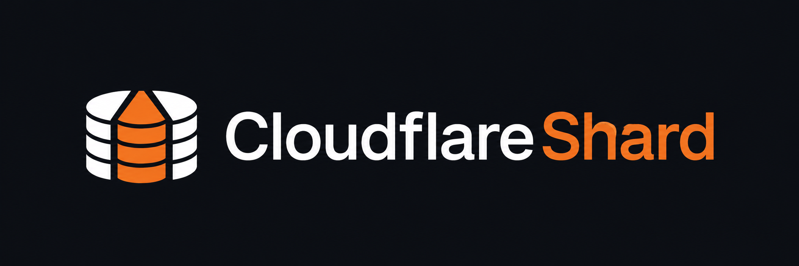

<p align="center">
  
</p>

<p align="center">
  <a href="https://cloudflare-shard-shardscope.ajill.workers.dev/?demo=1"><strong>Live demo</strong></a> ·
  <a href="#deploy-your-own"><strong>Deploy your own</strong></a> ·
  <a href="docs/guides/end-user.md"><strong>Docs</strong></a> ·
  <a href="CONTRIBUTING.md"><strong>Contributing</strong></a>
</p>

<p align="center">
  <a href="LICENSE"></a>
  <a href="https://developers.cloudflare.com/durable-objects/"></a>
</p>

A self-hosted, sharded SQL layer built entirely on Cloudflare Workers and Durable
Objects (SQLite-backed). No external database, no KV/D1/R2. One logical SQL
endpoint, tenant-scoped writes, cross-shard 2PC transactions, secondary
indexes, and online resharding (split/drain with a zero-downtime,
checksum-verified cutover).

Sharding is the primitive. Everything else (routing, transactions, secondary
indexes, resharding) sits on top of the same vBucket map.

## See it live

**[Try the live demo](https://cloudflare-shard-shardscope.ajill.workers.dev/?demo=1).**
It's a real dashboard (Shardscope) that visualizes topology, drives live load,
splits/drains/migrates shards under fire, and runs chaos attacks while a
correctness meter proves nothing was lost. Sample-data mode simulates the
topology/load walkthrough client-side: free, safe, no login needed. Driving
a real reshard or chaos attack needs your own live cluster. New here? Start
with the [end-user guide](docs/guides/end-user.md).

## Who this is for

- **Building an app on it?** → [Infrastructure builder guide](docs/guides/infrastructure-builder.md)
- **Running a cluster in production?** → [Operator guide](docs/guides/operator.md)
- **Evaluating the technology/architecture bet?** → [Investor guide](docs/guides/investor.md)
- **Just exploring?** → [End-user guide](docs/guides/end-user.md)

## Run it locally

```powershell
git clone https://github.com/ajillepalli/CloudflareShard.git
cd CloudflareShard
npm install
npm run dev
```

Needs Node.js 20+ and a Cloudflare account with Wrangler authenticated.

## Deploy your own

[](https://deploy.workers.cloudflare.com/?url=https://github.com/ajillepalli/CloudflareShard)

One click clones this repo into your GitHub and deploys the cluster (one
Worker plus three SQLite Durable Object classes: `CATALOG` control plane,
`SHARD` data plane, `COORDINATOR` for 2PC) into **your own Cloudflare
account**. No KV/D1/R2 resources; the cluster is self-contained.

Or from a clone: `npm run deploy`.

**Cost:** Durable Objects require the **Workers Paid** plan, and everything
created is billed to your account. This is a real database, not a sandbox.
Tear it down (`npx wrangler delete --name <your-worker>`) when you're done.

Set the `ADMIN_TOKEN` secret and call `/admin/init` to bring the topology up
before your first write. Full deploy/init/teardown walkthrough:
[docs/REFERENCE.md § Deploy your own cluster](docs/REFERENCE.md#deploy-your-own-cluster).

## Use it from your app

`client/` is a typed TypeScript SDK + CLI wrapping the whole HTTP API.
Recommended over hand-writing `fetch()`/`curl` calls. Full reference:
[`client/README.md`](client/README.md).

```ts
import { CloudflareShardAdminClient, CloudflareShardClient } from "cloudflare-shard-client";

const admin = new CloudflareShardAdminClient({ baseUrl: "http://127.0.0.1:8787", token: process.env.ADMIN_TOKEN! });
await admin.init({ numShards: 4, totalVBuckets: 256 });
await admin.createTable({
  table: "events",
  schema: "CREATE TABLE events (id TEXT PRIMARY KEY, user_id TEXT, body TEXT)",
  partitionKeyColumn: "id",
});

const { token } = await admin.registerTenant({ tenantId: "t1" });
const tenant = new CloudflareShardClient({ baseUrl: "http://127.0.0.1:8787", token });
await tenant.insert("events", "t1", "e1", { user_id: "user-1", body: "hello" });
```

For the full walkthrough (transactions, resharding, the CLI, and screenshots
of a real live run) see [`docs/REFERENCE.md`](docs/REFERENCE.md#full-api-walkthrough).

## Checks

```bash
npm run typecheck   # tsc --noEmit
npm test            # vitest run: backend suite (workerd)
npm run test:spa    # vitest run --config vitest.spa.config.ts: Shardscope SPA suite (jsdom)
```

## Learn more

- **[docs/REFERENCE.md](docs/REFERENCE.md)**: deploy-your-own-cluster details, the
  full API walkthrough, catalog sharding, tenant authorization, RPC access,
  known limitations, and observability.
- **[docs/SPEC.md](docs/SPEC.md)**: the canonical protocol/architecture reference: schemas,
  every HTTP route's request/response shape, the routing algorithm, write-idempotency contract,
  transaction semantics, rebalancing/split/drain, and the security/multi-tenancy model.
- **[docs/guides/](docs/guides/)**: perspective guides: [end-user](docs/guides/end-user.md),
  [infrastructure builder](docs/guides/infrastructure-builder.md),
  [operator](docs/guides/operator.md), [investor](docs/guides/investor.md).
- **[client/README.md](client/README.md)**: the typed TypeScript SDK + CLI reference.
- **[examples/rpc-consumer/README.md](examples/rpc-consumer/README.md)**: calling this API over
  a Durable Object RPC / Worker service binding instead of HTTP.
- **[examples/shardscope/README.md](examples/shardscope/README.md)**: the live mission-control
  dashboard's own documentation.
- **[TODOS.md](TODOS.md)**: the open roadmap and resolved milestones.
- **[CHANGELOG.md](CHANGELOG.md)**: release history.
- **[SECURITY.md](SECURITY.md)**: how to report a vulnerability.
- **[CODE_OF_CONDUCT.md](CODE_OF_CONDUCT.md)**: community standards for this project.

## License

[Apache-2.0](LICENSE). CloudflareShard is an independent project, not
affiliated with or endorsed by Cloudflare, Inc.
