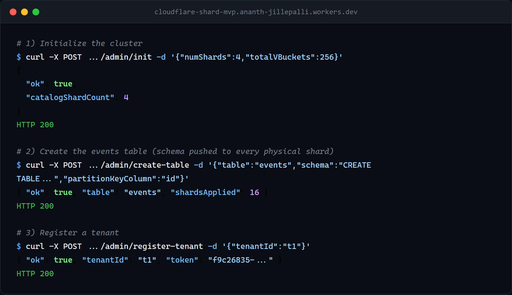
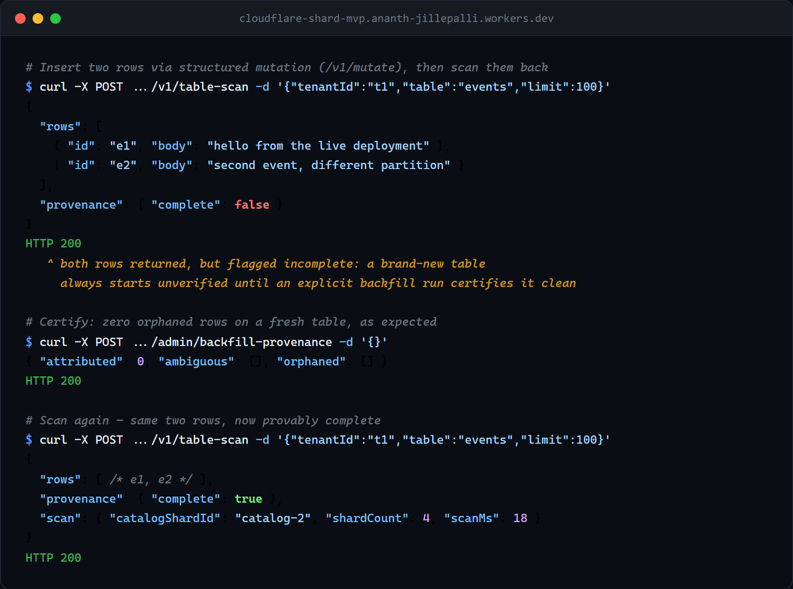

# Reference

Practical, how-to detail that doesn't belong in the README's quickstart. For the
formal protocol/architecture spec (every route's exact request/response shape,
schemas, the routing algorithm, transaction semantics), see [`SPEC.md`](SPEC.md).

## What this MVP demonstrates

- One logical SQL endpoint in a Worker.
- Catalog DO as control plane for table registry and vBucket map.
- Shard DOs as single-threaded SQLite execution nodes.
- Deterministic single-shard routing via `tenantId` + `table` + `partitionKey`.
- Scatter read endpoint for fan-out SELECT.
- Online vBucket migration: dual-write backfill with a fenced, checksum-verified cutover.
  `/admin/split-vbucket` performs a real data move, and `/admin/drain-shard` fully evacuates a
  shard (vbuckets first, then secondary-index placement rings via deterministic substitution,
  protected by a per-index write fence so no index entry is stranded on a shard mid-evacuation).
  See [`SPEC.md` §11](SPEC.md#11-rebalancing-split-and-drain-milestone-3--shipped) for the
  backfill/cutover/drain algorithm.
- A durable, TTL'd topology-operation lock serializes drain/split/migrate/create-index/drop-index
  so two concurrent cluster-reshaping operations can't race each other's preconditions;
  `/admin/topology-lock-status` and `/admin/force-release-topology-lock` give an operator
  visibility and recovery. See [`SPEC.md` §7](SPEC.md#7-public-http-api-gateway-worker) for both
  routes' request/response shapes.
- Mutation idempotency via `requestId`, rejecting replay with a mismatched SQL/params pair
  instead of returning a stale result.
- Fleet point-in-time restore with an immutable preview plan, exact plan-hash
  execution confirmation, deployment-wide fencing, manifest redo reconciliation,
  shard verification, ordered post-cutoff coordinator discard, and a hash-bound
  discarded-write report. See the
  [operator runbook](runbooks/fleet-pitr.md).

## Deploy your own cluster

Cloudflare's Deploy to Cloudflare flow does not deploy multiple Worker
applications from one repository together. It therefore cannot create this
complete topology; clone the repository and run the ordered aggregate command
below instead of using a one-Worker deploy button.

The complete topology is two Workers and six SQLite Durable Object classes:

1. The required route-less `cloudflare-shard-control-plane` Worker owns
   `JOURNAL_MANIFEST` (`JournalManifestDO`) and `FLEET_MANIFEST_CATALOG`
   (`FleetManifestCatalogDO`).
2. The public `cloudflare-shard-mvp` Worker owns `CATALOG` (`CatalogDO`),
   `SHARD` (`ShardDO`), `COORDINATOR` (`CoordinatorDO`), and the non-restored
   restore authority `RESTORE_COORDINATOR` (`RestoreCoordinatorDO`), and reaches
   the first Worker through its mandatory `CONTROL_PLANE` service binding.

There are no KV/D1/R2 resources; the cluster is self-contained. From a fresh
clone, `npm run deploy` enforces the safe creation order by running
`npm run deploy:control-plane` before `npm run deploy:root`. Use those two
commands in that order if deploying manually. For local development,
`npm run dev` loads both Wrangler configs together, so the route-less service
is available to the root Worker's `CONTROL_PLANE` binding before transaction
traffic is handled.

Set `DEPLOYMENT_FLEET_ID` before admitting transactions and keep it stable for
the life of these namespaces. The checked-in default is `default`. One
deployment is one physical restore domain: a restore preview must name this
exact fleet, and two logical fleet IDs cannot safely share the same Durable
Object namespaces and later be restored independently. The fleet PITR runbook
uses `RESTORE_FLEET_ID` only as an operator-side shell variable whose value must
equal `DEPLOYMENT_FLEET_ID`; it is not a second Worker setting.

**Cost:** SQLite-backed Durable Objects are available on Workers Free and Paid.
The Free plan is suitable for a bounded evaluation, not an implied production
allowance. As of 2026-08-05, Cloudflare documents 100,000 Worker requests/day,
5 million Durable Object rows read/day, and 100,000 rows written/day; exceeding
one of the daily Free limits makes further operations of that type fail. Verify
the current official [Durable Objects pricing](https://developers.cloudflare.com/durable-objects/platform/pricing/)
and [Workers limits](https://developers.cloudflare.com/workers/platform/limits/)
before a run. This is a real database in your account, not a sandbox.

**After both Workers deploy:**
1. Set the `ADMIN_TOKEN` secret (the setup page prompts for it via `.env.example`)
   to a strong random value: `openssl rand -hex 32`. It gates the whole `/admin/*`
   surface; without it the Worker returns `500 ADMIN_TOKEN is not configured`.
2. Build the zero-runtime-dependency client and run the read-only preflight:
   ```bash
   cd client && npm install && npm run build && cd ..
   export CLOUDFLARESHARD_URL=https://<your-worker>.workers.dev
   export CLOUDFLARESHARD_ADMIN_TOKEN=$ADMIN_TOKEN
   node client/dist/cli.js doctor
   ```
3. On a deployment created only for this evaluation, run the verified path:
   ```bash
   node client/dist/cli.js verify --disposable-target
   ```
   A fresh target is initialized with two shards without `force`; an existing
   initialized target is never reset. The verifier creates an isolated table
   and tenant, proves two distinct physical placements, commits one cross-shard
   transaction, replays its request ID, and reads back exactly one row per key.
   Because the current API has no table-drop operation, resources remain on the
   target. Tear the deployment down after the trial.
4. To build an app against it, download the starter from Shardscope's "Build on it"
   panel (it service-binds to exactly this Worker), or see `examples/rpc-consumer/`.

Every `doctor` and `verify` run writes a versioned, redacted JSON receipt with a
SHA-256 checksum under `.cloudflareshard/receipts/`. Receipts contain a hash of
the target origin, not its URL or credentials. `commit_pending_manifest` and
`committed_pending_ack` are both reported as `PENDING_RECONCILIATION` (exit 5),
not as verified success. The first state defers participant commit and strict
readback until manifest registration succeeds; the second is durably committed
but still waiting for every participant acknowledgement.

**Teardown:** run `npm run delete`. It deletes the public root Worker first and
the route-less control-plane Worker second. That order prevents a surviving
gateway from accepting new cross-shard work after its manifest dependency has
disappeared. Do not run `npm run delete:control-plane` while the root Worker is
still deployed. Full operational details and confirm-gated teardown guidance:
[`examples/shardscope/docs/deploy/`](../examples/shardscope/docs/deploy/).

## Project layout

- `src/index.ts`: Gateway worker router and public API.
- `src/catalog.ts`: Catalog durable object (metadata, routing, map changes).
- `src/shard.ts`: Shard durable object (SQLite execution + idempotency).
- `src/coordinator.ts`: Transaction coordinator durable object (decision,
  manifest admission, participant reconciliation, and recovery).
- `src/restore.ts`: Non-restored fleet restore authority, durable gate,
  immutable plan, shard PITR orchestration, coordinator discard, and
  verification report.
- `workers/control-plane/`: Required route-less Worker and
  `JournalManifestDO` plus fleet manifest catalog/close service.
- `docs/SPEC.md`: Concrete architecture and protocol spec.
- `docs/runbooks/fleet-pitr.md`: Destructive fleet PITR operator procedure and
  live rehearsal gate.
- `client/`: Typed TypeScript SDK + CLI for the HTTP API, see `client/README.md`. Recommended over hand-writing raw HTTP calls.
- `examples/rpc-consumer/`: Demo Worker calling the tenant data path over a Durable Object RPC / service binding instead of HTTP.
- `examples/tpc-c-benchmark/`: TPC-C-derived OLTP benchmark and demo project.
- `examples/shardscope/`: Live mission-control dashboard, topology visualization, operator reshard controls, and a chaos/load-testing panel. See `examples/shardscope/README.md`.

## Full API walkthrough

`client/` is a typed TypeScript SDK + CLI wrapping this whole HTTP API, so you
don't have to hand-write `fetch()`/`curl` calls or re-derive request/response
shapes yourself. This is the recommended way to talk to a cluster. See
`client/README.md` for the full reference.

```ts
import { CloudflareShardAdminClient, CloudflareShardClient } from "cloudflare-shard-client";

const admin = new CloudflareShardAdminClient({ baseUrl: "http://127.0.0.1:8787", token: process.env.ADMIN_TOKEN! });

// Initialize cluster metadata and shard map
await admin.init({ numShards: 4, totalVBuckets: 256 });

// Register a logical table and create its schema on every shard
await admin.createTable({
  table: "events",
  schema: "CREATE TABLE events (id TEXT PRIMARY KEY, user_id TEXT, body TEXT, created_at TEXT)",
  partitionKeyColumn: "id",
});

// Register a tenant
const { token } = await admin.registerTenant({ tenantId: "t1" });
const tenant = new CloudflareShardClient({ baseUrl: "http://127.0.0.1:8787", token });

// Insert data (tenant.update()/.delete()/.upsert() cover the other write ops)
await tenant.insert("events", "t1", "e1", { user_id: "user-1", body: "hello", created_at: new Date().toISOString() });

// Read: exact-tuple index lookups (tenant.indexQuery), or a tenant-scoped table scan
for await (const page of tenant.tableScanAll({ tenantId: "t1", table: "events" })) {
  console.log(page);
}

// Cross-shard atomic transaction
await tenant.tx([
  { op: "insert", table: "events", tenantId: "t1", partitionKey: "e2", values: { user_id: "user-1", body: "a" } },
  { op: "insert", table: "events", tenantId: "t1", partitionKey: "e3", values: { user_id: "user-1", body: "b" } },
]);

// Move one vbucket to a new shard, then watch it
await admin.splitVbucket({ catalogShardId: "catalog-0", vbucket: 42, newShardId: "shard-hotfix-1" });
await admin.migrateVbucketStatus({ catalogShardId: "catalog-0", vbucket: 42 });
```

The admin-only cross-tenant fan-out `/v1/scatter` deliberately has no SDK
wrapper (see `client/README.md`'s "What's covered" section for why). Call it
directly over HTTP using `ADMIN_TOKEN`; its request/response shape is in
[`SPEC.md` §7](SPEC.md#7-public-http-api-gateway-worker).

The CLI covers onboarding and the admin calls above for scripting/one-offs
without writing TypeScript:

```bash
export CLOUDFLARESHARD_URL=http://127.0.0.1:8787
export CLOUDFLARESHARD_ADMIN_TOKEN=<your ADMIN_TOKEN>
node client/dist/cli.js doctor
node client/dist/cli.js verify --disposable-target
node client/dist/cli.js init --num-shards 4 --total-vbuckets 256
node client/dist/cli.js create-table --table events --schema "CREATE TABLE events (id TEXT PRIMARY KEY, body TEXT)" --partition-key-column id
node client/dist/cli.js status
```

Fleet restore has five additional admin commands:

```bash
node client/dist/cli.js restore-preview --fleet-id default --cutoff 2026-08-06T18:30:00.000Z --idempotency-key incident-a
node client/dist/cli.js restore-status --restore-id <restore_id>
node client/dist/cli.js restore-execute --restore-id <restore_id> --plan-hash <exact_plan_hash>
node client/dist/cli.js restore-reconcile --restore-id <restore_id> --plan-hash <exact_plan_hash>
node client/dist/cli.js restore-rollback --restore-id <restore_id> --plan-hash <exact_plan_hash>
```

Preview may remain durably `previewing`; use status to observe the phase, then
replay the exact preview request with the same idempotency key to retrieve the
immutable plan. Execute is destructive and requires the exact hash from that plan.
During execution all ordinary ingress is fenced. A post-fence failure remains
`manual_repair_required` with the fence active until the named blocker is
repaired and the same plan is resumed with `restore-reconcile`. Provider PITR
and undo apply to physical shards. Post-cutoff coordinators are durably discarded
only after shard restore and verification; that discard is the irreversible
boundary after which `restore-rollback` is rejected. Local shard and catalog
fences release before the external fleet gate releases last. Full procedure:
[fleet PITR runbook](runbooks/fleet-pitr.md).

`doctor` is read-only. `verify` is intentionally mutating and refuses to run
without `--disposable-target`; it never passes `force:true`. On a TTY these
commands render an 80- or 120-column human report. Redirected output defaults
to one-line JSON; force either form with `--output human|json` or `--json`.
Color is disabled for redirected/JSON output and whenever `NO_COLOR` is set.
Stable exit codes are 0 success/ready, 2 invalid invocation or unsafe target,
3 prerequisite blocked, 4 verification failed, and 5 pending reconciliation.

**Proof this runs for real:** the screenshots below are unedited terminal
output from an actual live deployment, not fabricated example data.


*Cluster init, table registration, and schema creation: each returning HTTP 200.*


*A table-scan on a brand-new table starts `provenance.complete: false`; a `backfill-provenance` run reports zero orphaned rows; the same scan then reports `provenance.complete: true`.*

## Catalog sharding

The control plane is itself sharded: the cluster is partitioned across a fixed,
well-known set of catalog shards, and a tenant's catalog shard is chosen by
hashing `tenantId`. No lookup step, so the metadata store never needs to
shard itself recursively. Cluster-wide admin operations fan out to every
catalog shard; shard-scoped operations (split, drain) require an explicit
`catalogShardId`. Draining a shard is a full evacuation (vbuckets, then
secondary-index placement rings), not just a routing marker. See
[`SPEC.md` §4](SPEC.md#4-logical-data-partitioning) for the
hashing/partitioning scheme and
[§11](SPEC.md#11-rebalancing-split-and-drain-milestone-3--shipped) for
the full split/drain algorithm.

## Tenant authorization

The tenant data-plane routes (`/v1/mutate`, `/v1/tx`, `/v1/index-query`,
`/v1/table-scan`) require a tenant bearer token (`POST /admin/register-tenant`),
kept structurally separate from `ADMIN_TOKEN`. `/v1/sql` and `/v1/scatter` are
admin-only: a per-tenant SQL guard proved structurally unwinnable, and base
rows carry no physical `tenant_id` column, so a raw tenant `SELECT` could leak
another tenant's rows. See [`SPEC.md` §14](SPEC.md#14-security-and-multi-tenancy)
for the full trust model, including token rotation and revocation semantics.

## RPC / Worker service-binding access (additive, not a replacement)

Every route above is also reachable without HTTP, from a Worker in the same
Cloudflare account, via a service binding to `CloudflareShardRpc` (a
`WorkerEntrypoint` export in `src/index.ts` with one method per route). Tenant
methods (`mutate`, `tableScan`, `indexQuery`, `tx`) take the tenant token as an
explicit argument; admin/topology methods take `ADMIN_TOKEN` the same way.
Holding the binding alone is never sufficient authorization for either kind of
method. A full working example (a second Worker, wired via service binding,
with a real integration test proving the round trip over the actual binding)
lives in [`examples/rpc-consumer/`](../examples/rpc-consumer/README.md).

## Known limitations

- No SQL parser or policy sandboxing yet. Raw `/v1/sql` is an admin-only
  escape hatch (see [`SPEC.md` §2](SPEC.md#2-non-goals-mvp) and
  [§15](SPEC.md#15-migration-path-to-production)).
- `/v1/tx` transactions are capped at 8 distinct participant rows.
- `/v1/scatter` and `/v1/table-scan` can return duplicate (never missing) rows
  during an active vbucket-migration window. See
  [`SPEC.md` §11](SPEC.md#11-rebalancing-split-and-drain-milestone-3--shipped).
- `/v1/table-scan` supports only `table + tenantId + cursor + limit`, no
  arbitrary column filtering.
- Row provenance and the partition-key trust model inherit one collision case
  documented in [`SPEC.md` §14](SPEC.md#14-security-and-multi-tenancy): two
  tenants sharing a partition key on the same shard.

(Automatic split heuristics, unique-index support, and cross-tenant analytics
aggregation are tracked as open roadmap items. See
[`TODOS.md`](../TODOS.md); they're not listed here as limitations.)

## Observability

Every request logs a structured `http.request` event
(`{path, method, status, durationMs}`) from the Worker's single `fetch()`
entrypoint, regardless of which route or outcome, plus whatever
  event-specific `log()` calls the handler itself makes along the way. Manifest
  admission, route assignment, and catalog alarm recovery use a fixed
  `reliability.slo` event with `schema_version`, `event`, `component`,
  `operation`, `outcome`, `overloaded`, bounded `purpose`, `retryable`,
  `attempt_count`, `retry_after_ms`, and `observed_at`. The schema
does not accept transaction, tenant, or provider-error text, so operators get
bounded recovery signals without copying secrets or high-cardinality identifiers
into logs. Query them:

```powershell
# Live tail, JSON per line
npx wrangler tail --format json

# Filter to slow requests only
npx wrangler tail --format json | Select-String '"event":"http.request"' | Select-String -NotMatch '"durationMs":[0-9]{1,2}[,}]'

# Watch controlled reliability failures and recoveries
npx wrangler tail --format json | Select-String '"event":"reliability.slo"'
```

For an overloaded manifest dependency, `retry_after_ms` is the bounded cooldown
returned to the caller and counted by the coordinator's admission circuit. For
catalog alarm work, `attempt_count` increases durably for only the failed logical
purpose; a later `outcome:"recovered"` event confirms that purpose converged while
unrelated due purposes continued running. Retries do not expire at an arbitrary
attempt count, so alert on repeated `retry_scheduled` events or a rising
`attempt_count` for the same bounded `purpose` until `recovered` appears.

Or use the Cloudflare dashboard's **Workers Logs** view (Workers & Pages →
`cloudflare-shard-mvp` → Logs) for durable, searchable/filterable history.
Enabled via `wrangler.toml`'s `[observability]` block (`head_sampling_rate = 1`,
i.e. every request, not a sample).

For a deeper operational runbook (health monitoring, incident response,
running reshard operations safely, cost management), see
[`guides/operator.md`](guides/operator.md).
